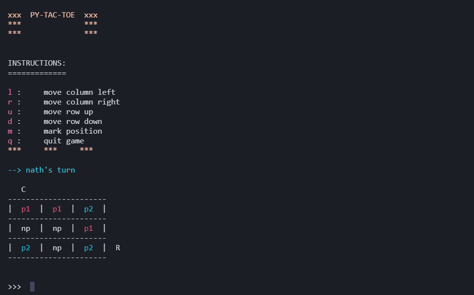

# py-tac-toe

Tic Tac Toe game written in python ( CLI ).

### How it is played

**py-tac-toe** is a two player game. During game play players can only make three moves.
Each player have a unique mark that gets inserted into the position they
choose to play on. When a player is out of moves, the player can remove a previous move ( player can remove the move that he made ) and replay with that move retrieved.

A player can navigate around the board using the navigation keys to position where to play on. Some of the navigation keys are

-- l ( moves column position to the left )

-- r ( moves column position to the right )

-- u ( moves row position up )

-- d ( moves row position down )

### Required functionalities

*this functionality will be removed from this list on next commit*
-- A command key to quit the game immediately    ( **Completed & Working** )
    

-- Main menu that displays highest score with outlined navigations below

    -- Play    -- Create Player    -- Instructions    -- Exit

-- Hot key response: Currently, board navigation during game play requires every navigation input to be followed by the return key, which is not actually user friendly. Hot key response will help to process a single input immediately they're inserted and process response for the input

-- Persistence ( Pickle should do )
